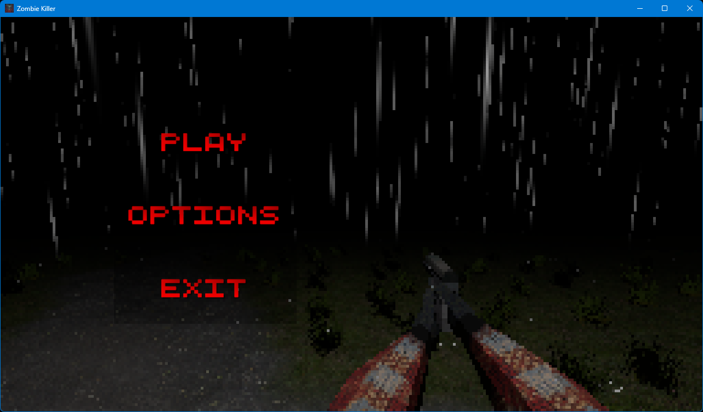
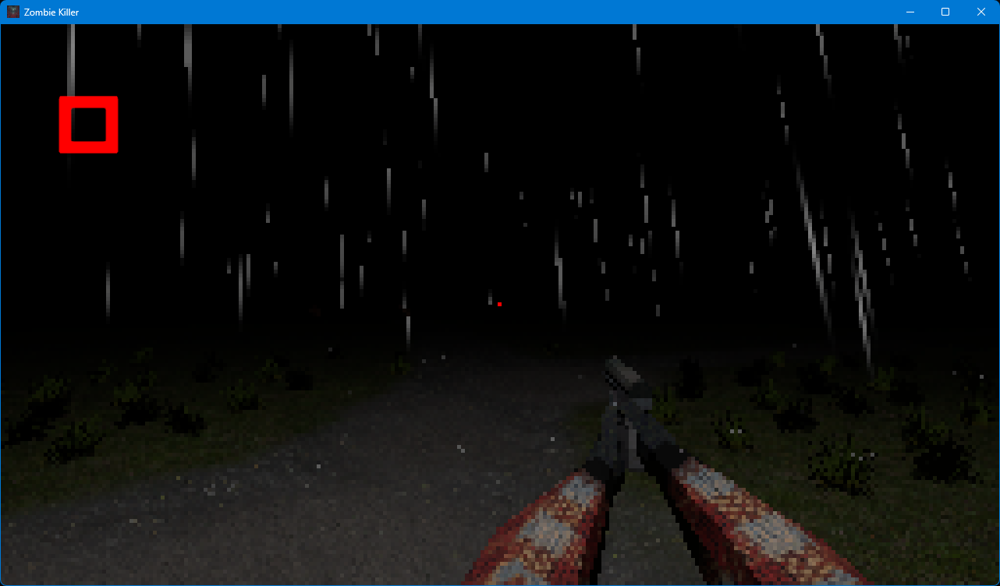
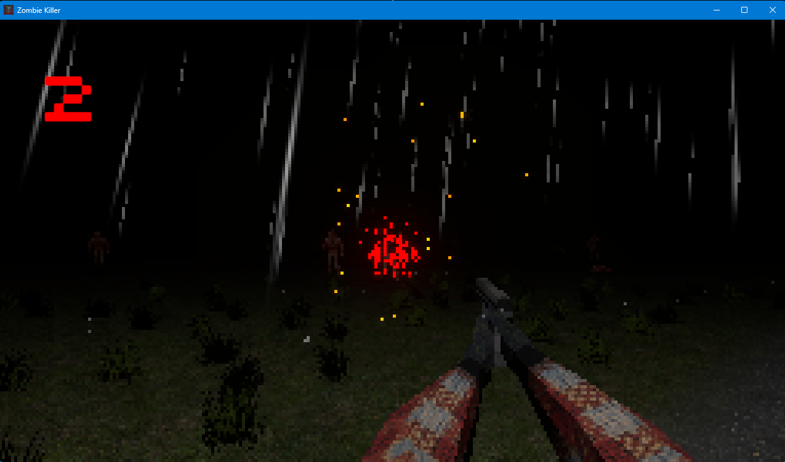
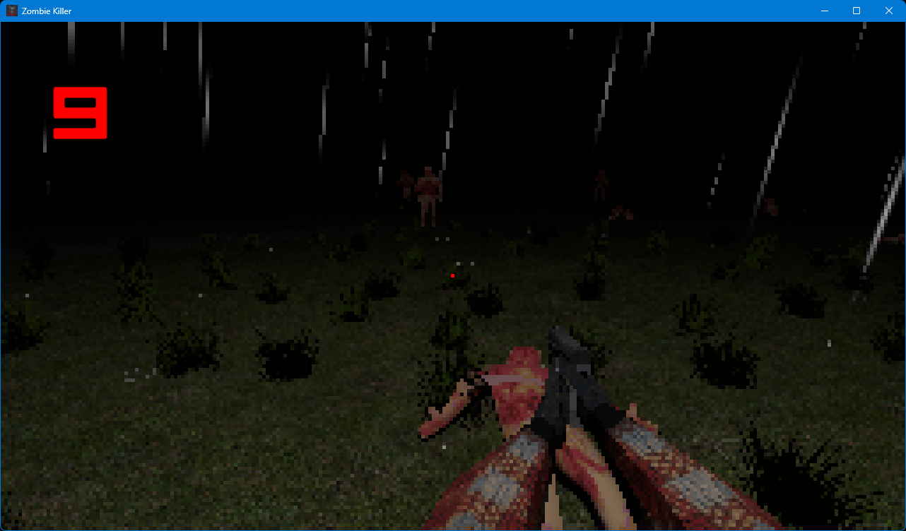
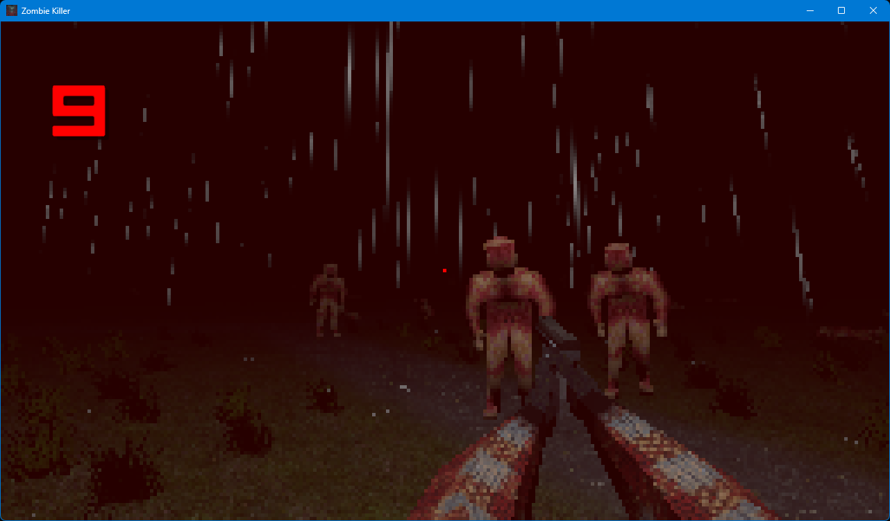
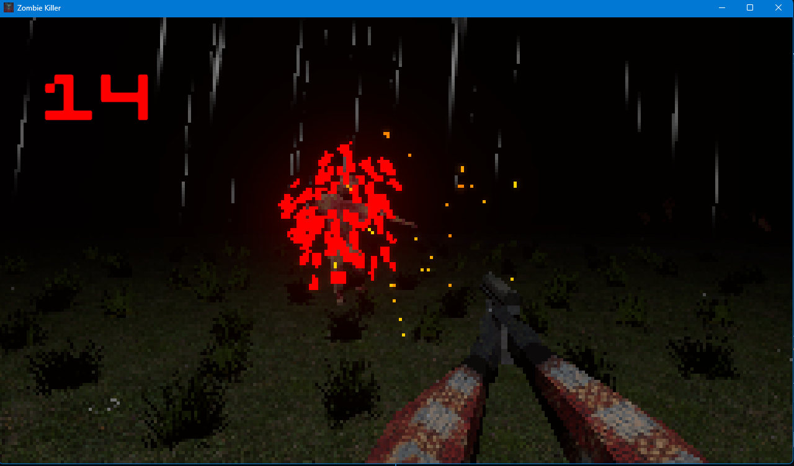
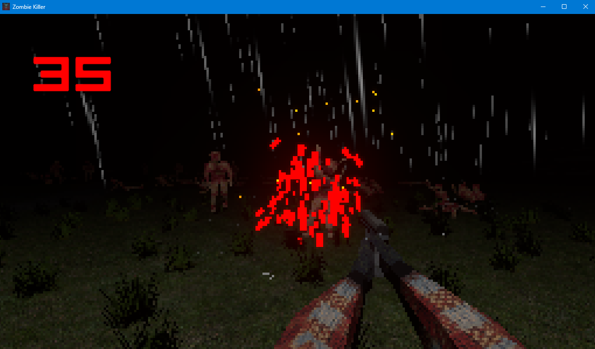

# Zombie Killer

A small first-person zombie shooter I made in Unity. I wanted it to look like an old PS2 game: low-poly models, pixelated screen, dark and rainy night. I made all the models myself in Blender (hands, gun, zombies).

## The game

You stand on a dirt road in a dark forest, it's raining, and zombies keep walking out of the dark. Shoot them before they reach you. The red number in the corner counts your kills. That's the whole game: survive as long as you can and get the highest number.

Every shot zombie blows up into a cloud of red pixels and sparks.

More of them come the longer you play.

If they get close they hurt you and the screen turns red. Back off and your health slowly comes back.

## Controls

- **WASD** - move
- **Mouse** - look around
- **Left click** - shoot
- **Esc** - pause

In the options menu you can change volume, mouse sensitivity and graphics quality.

## What's inside

- Hand-made models and animations in Blender
- Low-res pixel look with a URP render setup
- Rain, fog and a muzzle flash that lights up the dark
- Zombies that spawn around you and chase you
- Health that regenerates, with a red screen effect when you're hurt
- Main menu, options and pause menu
- Sound effects for the gun and zombies

## Running it

Open the project in Unity **6000.4.1f1** (or newer Unity 6), load the `Menu` scene from `Assets/Scenes` and press Play.
